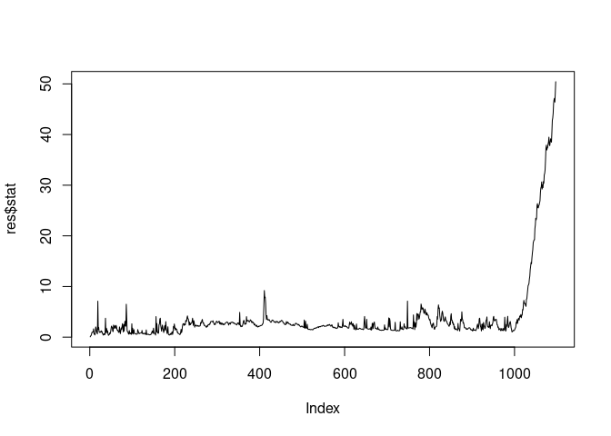
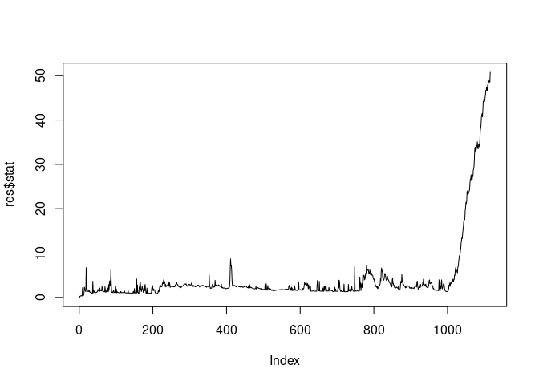
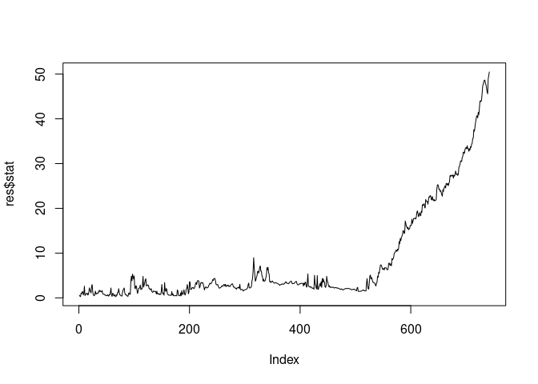
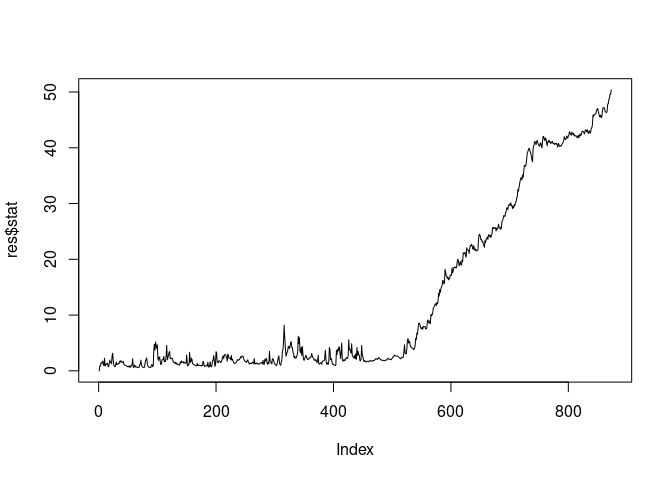
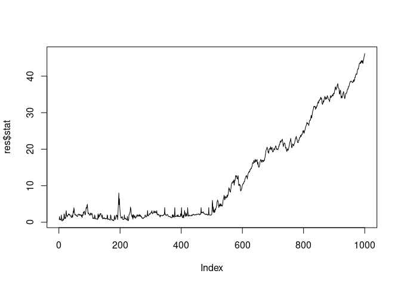
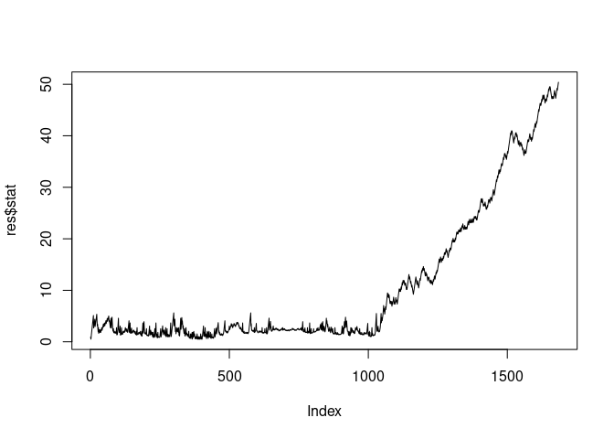
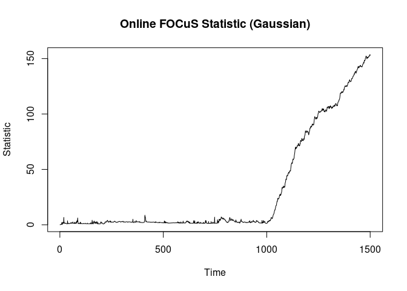

- [exfocus and np-focus Rcpp offline implementation for testing
  purposes](#exfocus-and-np-focus-rcpp-offline-implementation-for-testing-purposes)
- [Gaussian](#gaussian)
  - [Pre change parameter known](#pre-change-parameter-known)
  - [pre-change unknown](#pre-change-unknown)
- [Gamma](#gamma)
  - [known](#known)
  - [unknown](#unknown)
- [Other distributions](#other-distributions)
- [NP-FOCuS](#np-focus)

## exfocus and np-focus Rcpp offline implementation for testing purposes

To install the package, please clone this repo, and run after entering
the specified directory:

``` r
install.packages(".", repos = NULL, type = "source")
library(exfocus.rcpp)
```

# Gaussian

## Pre change parameter known

Here we test the pre-change parameter known recursion, for gaussian
change in mean.

``` r
theta0 <- 0
set.seed(45)
Y <- c(rnorm(1e3, theta0), rnorm(500, theta0 - 1))

res <- focus_offline(Y, 50, family = "gaussian", theta0 = theta0, args = list(), adp_max_check = F)
plot(res$stat, type = "l")
```



## pre-change unknown

To specify the pre-change unkown we have to set the theta0 parameter to
NaN.

``` r
theta0 <- 0
set.seed(45)
Y <- c(rnorm(1e3, theta0), rnorm(500, theta0 - 1))

res <- focus_offline(Y, 50, family = "gaussian", theta0 = NaN, args = list(), adp_max_check = F)
plot(res$stat, type = "l")
```



# Gamma

## known

Please specify the shape argument in the args list to perform
exponential!

``` r
theta0 <- 4
shape <- 4
set.seed(42)
Y <- c(rgamma(500, rate = theta0, shape = shape), rgamma(500, rate = theta0 - 1, shape = shape))

# note that I have coded it for change in scale! As in the paper, but this can be changed any time in the interface. 
system.time(res <- focus_offline(Y, 50, family = "gamma", theta0 = 1/theta0, args = list(shape = 4), adp_max_check = F))
```

       user  system elapsed 
          0       0       0 

``` r
plot(res$stat, type = "l")
```



## unknown

``` r
theta0 <- 4
shape <- 4
set.seed(42)
Y <- c(rgamma(500, rate = theta0, shape = shape), rgamma(500, rate = theta0 - 1, shape = shape))

# note that I have coded it for change in scale! As in the paper, but this can be changed any time in the interface. 
system.time(res <- focus_offline(Y, 50, family = "gamma", theta0 = NaN, args = list(shape = 4), adp_max_check = F))
```

       user  system elapsed 
      0.001   0.000   0.000 

``` r
plot(res$stat, type = "l")
```



# Other distributions

Similarly, we have Bernoulli and Poisson.

``` r
### poisson ####
theta0 <- 2
set.seed(42)
Y <- c(rpois(500, theta0), rpois(500, 1.5))

system.time(res <- focus_offline(Y, 50, family = "poisson", theta0 = theta0, args = list(shape = 4), adp_max_check = F))
```

       user  system elapsed 
          0       0       0 

``` r
plot(res$stat, type = "l")
```



``` r
#### bernoulli ####
theta0 <- 0.4
set.seed(45)
Y <- c(rbinom(1e3, 1, theta0), rbinom(1e3, 1, theta0 + .2))
system.time(res <- focus_offline(Y, 50, family = "bernoulli", theta0 = theta0, args = list(), adp_max_check = F))
```

       user  system elapsed 
          0       0       0 

``` r
plot(res$stat, type = "l")
```



# NP-FOCuS

Finally, NP-FOCuS can run as:

``` r
set.seed(42)
Y <- c(rnorm(5000), rnorm(100, sd = 2))


probs <- computeprobsNPPELT(15)
quants <- qnorm(probs)
system.time(res <- npfocus_offline(Y = Y, threshold = c(90, 15), quantiles = quants))
```

       user  system elapsed 
      0.027   0.000   0.027 

``` r
par(mfrow = c(2, 1))
plot(res$max_stat, type = "l")
plot(res$sum_stat, type = "l")
```



``` r
par(mfrow = c(1, 1))

which.max(table(apply(res$tau_stat[, 1:res$n], 2, median)))
```

    647 
    116 
